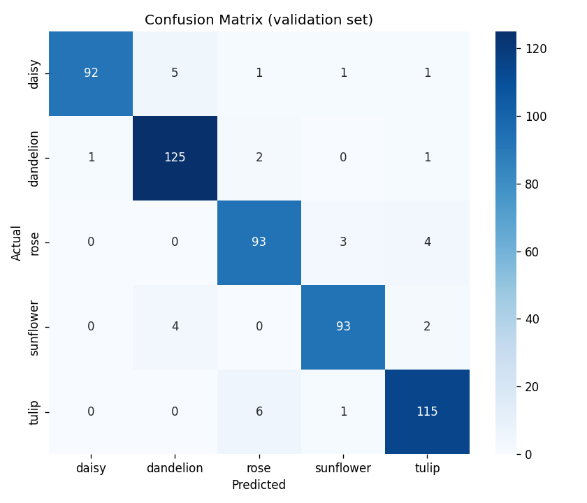

# flower-classification

# dataset
https://www.kaggle.com/datasets/imsparsh/flowers-dataset

# Confusion Matrix


# Installation
install from requirements.txt

# How to run
## Extract Feature
```
python extract_feature.py
```
## Train
```
python train.py
```

## Predict
```
python predict.py <image path>
```
